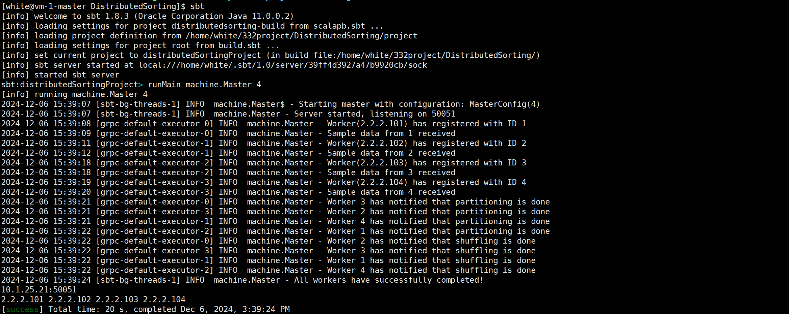
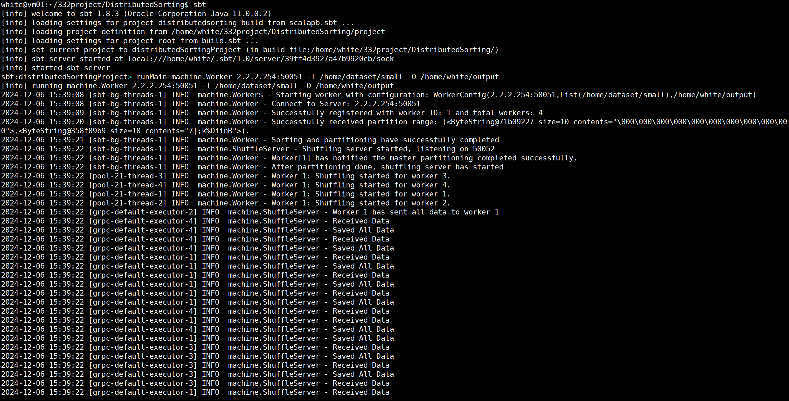
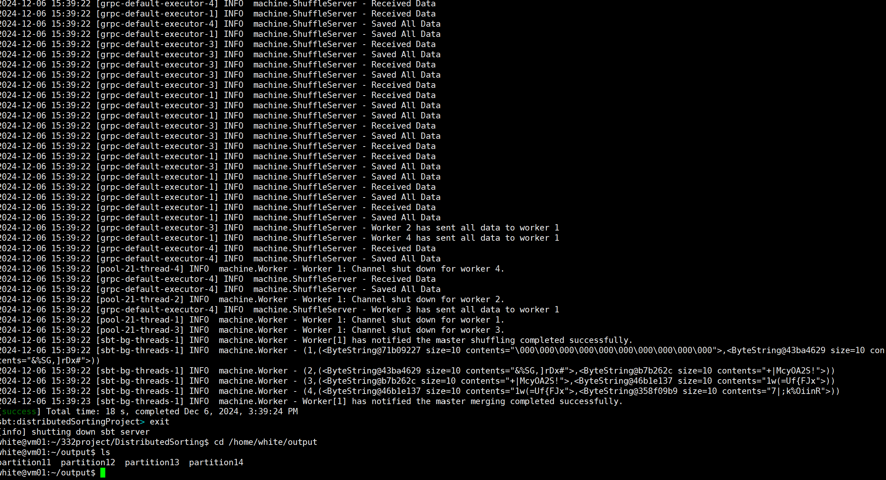

# 332Project

Distributed Sorting Project

## Index
[0. Installation Guideline](#installation-guideline)
[1. How to Build](#how-to-build)
[2. How to Run](#how-to-run)
[3. Teammates](#teammates)

## Installation Guideline

환경 설정 (이미 각 master, worker 머신에 설정해놓았지만 필요한 경우 설정하시면 됩니다.)
1. 자바, 스칼라, SBT설치

```shell
cd ~
wget https://download.java.net/openjdk/jdk11.0.0.2/ri/openjdk-11.0.0.2_linux-x64.tar.gz
wget https://downloads.lightbend.com/scala/2.13.15/scala-2.13.15.tgz
wget https://github.com/sbt/sbt/releases/download/v1.8.3/sbt-1.8.3.tgz
tar -xvf openjdk-11.0.0.2_linux-x64.tar.gz
tar -xvf scala-2.13.15.tgz
tar -xvf sbt-1.8.3.tgz
```

2. 환경변수 설정
```shell
vim ~/.bashrc
```

a. vim 에서 추가
```bash
export PATH=/home/white/jdk-11.0.0.2/bin:$PATH:~/.sbt.bin
export PATH=/home/white/scala-2.13.15/bin:$PATH:~/.sbt.bin
export PATH=/home/white/sbt/bin:$PATH
export PATH=$PATH:~/.sbt.bin
```

b. vim 저장 후
```shell
source .bashrc
```

3. 설치 확인
```shell
java -version
javac -version
scala -version
scalac -version
sbt -version
```

## How to Build

1. Master server에 repository를 git clone한다.
```shell
[white@vm-1-master ~]$ git clone https://github.com/komseok0109/332project.git
```
2. 332project/DistributedSorting 으로 이동한다.
```shell
[white@vm-1-master ~]$ cd ~/332project/DistributedSorting
```
DistributedSorting은 다음과 같이 구성되어 있다.
```shell
[white@vm-1-master DistributedSorting]$ ls
build.sbt  clean.sh  delete.sh  gitClone.sh  output.sh  project  src  workers.txt
```
3. gitClone.sh를 실행하여 각 worker server (2.2.2.101 ~ 2.2.2.111) 에 332project git repository를 clone할 수 있다. 각 worker machine에 clone이 필요한 경우 해당 shell script를 실행하면 된다.
```shell
[white@vm-1-master DistributedSorting]$ ./gitClone.sh
```
4. output.sh를 실행하여 Output 디렉토리를 생성한다. 각 worker에 `/home/white/output` 디렉토리를 생성한다. 따로 output 디렉토리를 생성하고 싶거나 생성한 경우 이 과정은 건너뛰어도 된다.
```shell
[white@vm-1-master DistributedSorting]$ ./output.sh
```

cf. 3번, 4번 과정은 편의를 위한 것이므로, shell script 관련 오류가 발생하는 경우 각 worker에서 git repo를 clone하고 output 디렉토리를 생성하는 과정은 linux 명령어로 대체하면 된다.

5. 이후, master, worker machine에서 compile을 진행한다. compile은 build.sbt가 있는 디렉토리, clone한 repo의 332project/DistributedSorting 디렉토리에서 실행해야 한다.
- sbt  를 입력하여 sbt를 실행시킨다
- compile  을 입력하여 코드를 컴파일한다.
```shell
# Master에서의 예시
[white@vm-1-master DistributedSorting]$ sbt
... # sbt 실행
[info] started sbt server
sbt:distributedSortingProject> compile
... # compile
[success] Total time: 13 s, completed Dec 6, 2024, 3:25:57 PM
sbt:distributedSortingProject> exit
[info] shutting down sbt server
[white@vm-1-master DistributedSorting]$

# Worker에서의 예시
white@vm01:~/332project/DistributedSorting$ sbt
... # sbt 실행
[info] started sbt server
sbt:distributedSortingProject> compile
... # compile
[success] Total time: 9 s, completed Dec 6, 2024, 3:30:28 PM
sbt:distributedSortingProject> exit
[info] shutting down sbt server
white@vm01:~/332project/DistributedSorting$ 
```

## How to Run
- 주의사항
1. input/output 디렉토리가 존재해야 한다.
2. input 디렉토리에는 input file 이외에 아무것도 없어야 한다.
3. output 디렉토리에는 아무 파일도 없어야 한다.
4. output 디렉토리는 output.sh로 생성한 후, 임의로 이름을 변경하거나 디렉토리 내부에 파일을 추가하지 않아야 한다. (즉, 실행 전에 output 디렉토리는 비어있어야 한다.)
5. 다른 테스트를 진행한 후, output 디렉토리 내부의 파일을 지우려면 output.sh를 실행하면 된다. 해당 script는 `/home/white/output` 디렉토리를 지우고 다시 생성한다.

실행하는 방법은 다음과 같다. 

먼저, 각 master와 worker에서 sbt를 실행한다. 마찬가지로, build.sbt가 있는 디렉토리에서 실행해야 한다.
- Master
```shell
[white@vm-1-master DistributedSorting]$ sbt
... # sbt 실행중
[info] started sbt server
sbt:distributedSortingProject> 
```
- Worker
```shell
white@vm01:~/332project/DistributedSorting$ sbt
... # sbt 실행중
[info] started sbt server
sbt:distributedSortingProject>
```

이후, sbt에서 각 명령어를 입력해 실행한다. worker와 master의 명령어는 다음과 같다. master를 실행하고 각 worker들을 실행해야 한다. worker들간의 실행 순서는 관계 없지만 모든 worker는 master가 실행된 후에 실행되어야 한다. master의 ip는 내부 ip인 2.2.2.254 혹은 10.1.25.21 둘 중 하나를 사용하면 된다. 
master: `runMain machine.Master [Number of Worers]`
worker: `runMain machine.Worker [MASTER_IP]:50051 -I [ABSOLUTE_PATH_OF_INPUT_DIRECTORIES] -O [ABSOLUTE_PATH_OF_OUTPUT_DIRECTORY]`

**주의사항**: master 코드가 서버를 열기 전에 worker를 실행하면 서버가 열리지 않았기에 연결이 실패되고 오류가 발생해 실행이 종료된다. 해당 사항을 대비해 master코드를 실행한 후 아래와 같이 서버가 시작되었다는 로그가 출력된 것을 확인한 후에 worker들을 실행해야 한다. (master를 먼저 실행했으면 웬만하면 해당 에러가 발생하지 않지만 master 머신에서 sbt 실행 속도가 worker보다 느리거나 등의 문제로 실제 실행은 worker가 먼저 실행될 수도 있다. 해당 상황을 위해서 로그 출력을 확인한 후 worker를 실행하는 것이 안전하다.)
```shell
sbt:distributedSortingProject> runMain machine.Master 4
[info] running machine.Master 4
2024-12-06 15:39:07 [sbt-bg-threads-1] INFO  machine.Master$ - Starting master with configuration: MasterConfig(4)
2024-12-06 15:39:07 [sbt-bg-threads-1] INFO  machine.Master - Server started, listening on 50051
```

예시는 다음과 같다.
- Master
```shell
sbt:distributedSortingProject> runMain machine.Master 4
```
- Worker
```shell
sbt:distributedSortingProject> runMain machine.Worker 10.1.25.21:50051 -I /home/dataset/small -O /home/white/output
```

input 디렉토리가 여러개라면 띄어쓰기를 통해 구분한다.
(예시) input 디렉토리 path : /home/dataset/large1  과, /home/dataset/large2 인 경우
```shell
sbt:distributedSortingProject> runMain machine.Worker 2.2.2.254:50051 -I /home/dataset/large1 /home/dataset/large2 -O /home/white/output"
```
로 실행하면 된다.

실행 예시와 결과 예시:
- Master

- Worker
  


만약, 실행 중 특정 worker나 master에서 오류가 발생한 경우 master와 worker를 모두 `ctrl + c`를 활용하여 종료시킨 후에 output.sh를 이용하여 `/home/white/output`의 내용을 모두 삭제하고 다시 실행해야 한다. 만약 다른 output 디렉토리를 생성해서 실행하는 경우에도 해당 디렉토리에 내용을 모두 지우고 다시 실행해야 한다.


## How to Test 
아래는 테스트 하는 법에 대한 문서이다. 실행과는 크게 관계없다.

output 파일의 형식은 다음과 같다:
                **partition[w][p]**
=> 여기서 w = 실행시 할당받은 worker ID, p = partition number (1~4) 이다.
(예시) worker 1의 output file은 각각 partition11, partition12, partition13, partition14 이다.

이 output file들을 전부 valsort로 검사한 후, 하나의 파일로 합쳐야 한다.
gensort documentation에 따라 각 worer에서 다음의 명령어를 실행하여 각 worker의 output file이 정렬되었는지 검사하고, 하나로 합친다. 아래는 하나의 예시이다.
```shell
cd ~
./valsort -o 1.sum output/partition[W]1
./valsort -o 2.sum output/partition[W]2
./valsort -o 3.sum output/partition[W]3
./valsort -o 4.sum output/partition[W]4
cat 1.sum 2.sum 3.sum 4.sum > all[W].sum
./valsort -s all[W].sum
```
각 worker에 대해 all[w].sum 을 생성했다면, master에 각 파일을 전부 가져와서 모두 합쳐야 한다. 다음의 명령어를 실행하여 모든 all[w].sum 파일을 가져온다.
```shell
scp white@2.2.2.101:/home/white/all1.sum ~
scp white@2.2.2.102:/home/white/all2.sum ~
scp white@2.2.2.103:/home/white/all3.sum ~
scp white@2.2.2.104:/home/white/all4.sum ~
scp white@2.2.2.105:/home/white/all5.sum ~
scp white@2.2.2.106:/home/white/all6.sum ~
scp white@2.2.2.107:/home/white/all7.sum ~
scp white@2.2.2.108:/home/white/all8.sum ~
scp white@2.2.2.109:/home/white/all9.sum ~
```
이때 worker의 IP주소와 worker ID는 아무 관계없다. 실행시킬 때 IP주소를 2.2.2.109부터 실행했다면 109가 worker ID 1을 할당받는다. master가 출력하는 IP주소 순서가 worker ID순서이니 그걸 참고하면 된다. 모든 all[w].sum 파일을 가져왔다면 다음 명령어를 실행하여 모든 all[w].sum 파일을 합치고 valsort로 검사한다.
```shell
cd ~
cat all1.sum all2.sum all3.sum all4.sum all5.sum all6.sum all7.sum all8.sum all9.sum > all.sum
./valsort -s all.sum
```
## Teammates

[고민석](https://github.com/komseok0109)
[신재욱](https://github.com/shinjw4929)
[하동은](https://github.com/Binny-B)
