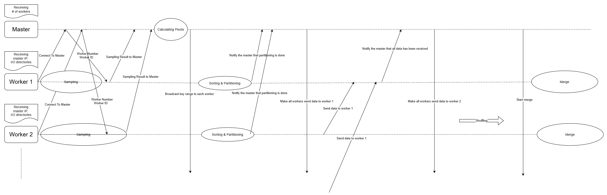

# Distributed Sorting Design Report

## Programming Environment
JDK: 11
SBT: 1.8.3
scala: 2.13.15

### Milestones

- **Milestone #0: Define Commit Convention and Coding Style**
  - Establish commit message conventions and code formatting guidelines.

- **Milestone #1: Generate Input Data Using Gensort**
  - Use the `gensort` tool to create input data for testing.

- **Milestone #2: Familiarize with gRPC by Writing Example Code**
  - Learn to configure `scalapb` for Scala-based gRPC.
  - Write basic example code to understand gRPC operations.

- **Milestone #3: Define gRPC Messages and Fields**
  - Break down the distributed sorting process into four phases.
  - Define the messages and fields required for each phase in gRPC.

- **Milestone #4: Select Libraries**
  - Research and choose libraries for file I/O, synchronization, and asynchronous operations.

- **Milestone #5: Implement Master and Worker for Command Execution**
  - Implement server start and stop functionality.
  - Parse and apply command-line arguments for distributed sorting execution.

- **Milestone #6: Implement Phase 1 - Sampling**
  - Workers sample data randomly and send samples to the master.
  - The master collects samples and determines key ranges.

- **Milestone #7: Implement Phase 2 - Sorting and Partitioning**
  - Sort each input block and save as a temporary file.
  - Partition each block and group keys by range into dedicated blocks.

- **Milestone #8: Implement Phase 3 - Shuffling**
  - Design and implement a method for data shuffling between workers.

- **Milestone #9: Implement Phase 4 - Merging**
  - Merge sorted blocks within each worker.
  - Select an efficient merging algorithm or library, and design parallelized merging.

- **Milestone #10: Implement Testing and Validation**
  - Design unit and integration tests for each phase to verify correctness and performance.

## Libraries 
- File I/O: `java.io` (FileReader, FileWriter, BufferedReader), `scala.io,Source`  
- Synchronization: `CountDownLatch`, `CyclicBarrier`, `phaser` 
- Asynchronization: `Future`

More additional library: Cats Effect, ZIO, Monix, Quasar, FS2

## Overall Flow Chart

## Message
<table>
  <tr>
    <th>service</th>
    <th colspan="2">Master <-> Worker</th>
  </tr>
  <tr>
    <td rowspan="5">rpc</td>
    <td><code>registerWorker</td>
    <td>worker-to-master server connection</td>
  </tr>
  <tr>
    <td><code>calculatePivots</td>
    <td>Determine the pivot based on sampled data and distribute it to the workers.</td>
  </tr>
  <tr>
    <td><code>partitionEndMsg</td>
    <td>signaling the end of a worker’s partitioning</td>
  </tr>
  <tr>
    <td><code>startShuffling</td>
    <td>Start shuffling for each worker</td>
  </tr>
  <tr>
    <td><code>mergeEndMsg</td>
    <td>confirming completion of merging</td>
  </tr>
</table>

<table>
  <tr>
    <th rowspan="1">rpc</th>
    <th colspan="2">registerWorker : register each worker to master</th>
  </tr>
  <tr>
    <th rowspan="4">message</th>
    <td rowspan="2">RegisterWorkerRequest (worker -> master)</td>
    <td><code>string workerIP</code> : [worker's IP address]</td>
  </tr>
  <tr>
    <td><code>int32 workerID</code> : [worker's ID number]</td>
  </tr>
  <tr>
    <td>RegisterWorkerReply (master -> worker)</td>
    <td><code>int32 totalWorkerCount</code> : [total number of workers]</td>
  </tr>
</table>

<table>
  <tr>
    <th rowspan="1">rpc</th>
    <th colspan="2">calculatePivots : Determine the pivot based on sampled data and distribute it to the workers.</th>
  </tr>
  <tr>
    <th rowspan="4">message</th>
    <td>CalculatePivotRequest (worker -> master)</td>
    <td>
      <code>int32 workerID</code> : [worker's ID number, to say which worker's sampling ended] 
      <code>repeated string sampleData</code> : [worker's sampled data]
    </td>
  </tr>
  <tr>
    <td>CalculatePivotReply (master -> worker)</td>
    <td>
      <code>map&lt;int32, string&gt; workerIPs</code> : [map { workerID -> workerIP }]  
      <code>map&lt;string, int32&gt; key2Worker</code> : [map { key -> workerID }]
    </td>
  </tr>
</table>

<table>
  <tr>
    <th rowspan="1">rpc</th>
    <th colspan="2">partitionCompleteMsg : signals to the master that data partitioning by each worker is complete.
    </th>
  </tr>
  <tr>
    <th rowspan="4">message</th>
    <td>PartitioningCompleteRequest
     (worker -> master)</td>
    <td>
      <code>int32 workerID</code>
    </td>
  </tr>
  <tr>
    <td>PartitioningCompleteReply (master -> worker)</td>
    <td>
      empty 
    </td>
  </tr>
</table>

<table>
  <tr>
    <th rowspan="1">rpc</th>
    <th colspan="2">startShuffling : signals to the master that merging by each worker is complete
    </th>
  </tr>
  <tr>
    <th rowspan="4">messages</th>
    <td>StartShufflingRequest
     (worker -> master)</td>
    <td>
      <code>int32 receiver</code>
    </td>
  </tr>
  <tr>
    <td>StartShufflingReply (master -> worker)</td>
    <td>
      empty 
    </td>
  </tr>
</table>

<table>
  <tr>
    <th rowspan="1">rpc</th>
    <th colspan="2">startShuffling : signals to the master that merging by each worker is complete
    </th>
  </tr>
  <tr>
    <th rowspan="4">messages</th>
    <td>MergingCompleteRequest
     (worker -> master)</td>
    <td>
      <code>int32 workerID</code>
    </td>
  </tr>
  <tr>
    <td>MergingCompleteReply (master -> worker)</td>
    <td>
      empty 
    </td>
  </tr>
</table>

<table>
  <tr>
    <th rowspan="1">service</th>
    <th colspan="2">Worker <-> Worker
    </th>
  </tr>
  <tr>
    <th rowspan="4">rpc</th>
    <td>sendDataToWorker</td>
    <td>
      send data from one worker to others
    </td>
  </tr>
  <tr>
    <td>shuffleAckno</td>
    <td>
      Notify receiver that all data has been sent.
    </td>
  </tr>
</table>

<table>
  <tr>
    <th rowspan="1">rpc</th>
    <th colspan="2">sendDataToWorker
    </th>
  </tr>
  <tr>
    <th rowspan="4">messages</th>
    <td>sendDataRequest
    </td>
    <td>
      <code>repeated string datas</code> : [List of data to be sent]
       <code>int32 source</code> : [ID of the worker sending the data]
    </td>
  </tr>
  <tr>
    <td>sendDataReply</td>
    <td>
      empty 
    </td>
  </tr>
</table>

<table>
  <tr>
    <th rowspan="1">rpc</th>
    <th colspan="2">shuffleAckno: Notify receiver that all data has been sent.
    </th>
  </tr>
  <tr>
    <th rowspan="4">messages</th>
    <td>shuffleAcknoRequest
    </td>
    <td>
    <code>int32 source</code>
    </td>
  </tr>
  <tr>
    <td>shuffleAcknoReply</td>
    <td>
      empty 
    </td>
  </tr>
</table>

Feedback from TA: Duplicate messages can be reused.

