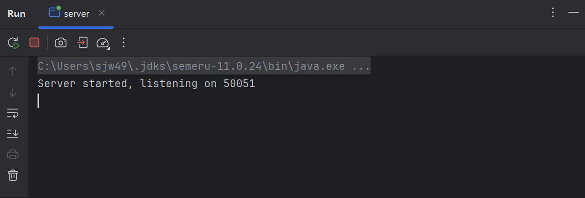
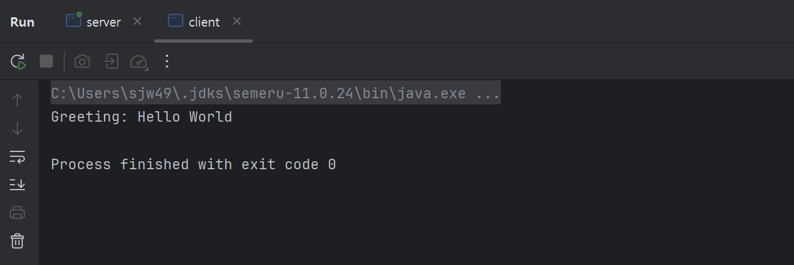
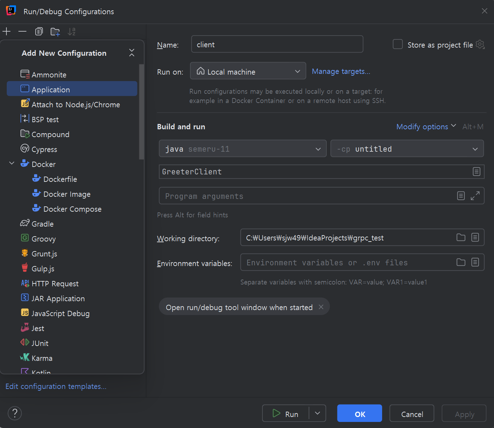

# gRPC

JDK : 11

SDK : 2.13.15

SBT : 1.10.5

- build.sbt
    - 변경

```scala
ThisBuild / version := "0.1.0-SNAPSHOT"
ThisBuild / scalaVersion := "2.13.15"

lazy val root = (project in file("."))
  .settings(
    name := "untitled",
    libraryDependencies ++= Seq(
      "com.thesamet.scalapb" %% "scalapb-runtime-grpc" % scalapb.compiler.Version.scalapbVersion,
      "io.grpc" % "grpc-netty-shaded" % scalapb.compiler.Version.grpcJavaVersion,
      "com.google.protobuf" % "protobuf-java" % "3.21.12"
    ),
    Compile / PB.targets := Seq(
      scalapb.gen(flatPackage = true) -> (Compile / sourceManaged).value / "scalapb"
    )
  )
```

- project/scalapb.sbt
    - 생성

```scala
**addSbtPlugin("com.thesamet" % "sbt-protoc" % "1.0.6")

libraryDependencies += "com.thesamet.scalapb" %% "compilerplugin" % "0.11.11"**
```

- src/main/protobuf/hello.proto
    - 생성

```scala
syntax = "proto3";

package hello;

service Greeter {
  rpc SayHello (HelloRequest) returns (HelloReply) {}
}

message HelloRequest {
  string name = 1;
}

message HelloReply {
  string message = 1;
}

```

- sbt실행
    - compile입력

- src/main/scala/GreeterServer.scala
    - 생성

```scala
import io.grpc.ServerBuilder
import scala.concurrent.{ExecutionContext, Future}
import hello._

object GreeterServer {
  def main(args: Array[String]): Unit = {
    val server = new GreeterServer(ExecutionContext.global)
    server.start()
    server.blockUntilShutdown()
  }
}

class GreeterServer(executionContext: ExecutionContext) { self =>
  private[this] var server: io.grpc.Server = null

  def start(): Unit = {
    server = ServerBuilder.forPort(50051)
      .addService(GreeterGrpc.bindService(new GreeterImpl, executionContext))
      .build()
      .start()
    println("Server started, listening on " + 50051)
    sys.addShutdownHook {
      System.err.println("*** shutting down gRPC server since JVM is shutting down")
      self.stop()
      System.err.println("*** server shut down")
    }
  }

  def stop(): Unit = {
    if (server != null) {
      server.shutdown()
    }
  }

  def blockUntilShutdown(): Unit = {
    if (server != null) {
      server.awaitTermination()
    }
  }

  class GreeterImpl extends GreeterGrpc.Greeter {
    override def sayHello(req: HelloRequest): Future[HelloReply] = {
      val reply = HelloReply(message = "Hello " + req.name)
      Future.successful(reply)
    }
  }
}

```

- src/main/scala/GreeterClient.scala
    - 생성

```scala
import io.grpc.ManagedChannelBuilder
import scala.concurrent.{Await, Future}
import scala.concurrent.duration._
import hello._

object GreeterClient {
  def main(args: Array[String]): Unit = {
    val channel = ManagedChannelBuilder.forAddress("localhost", 50051)
      .usePlaintext()
      .build()

    val stub = GreeterGrpc.stub(channel)

    val request = HelloRequest(name = "World")
    val responseFuture: Future[HelloReply] = stub.sayHello(request)

    val response = Await.result(responseFuture, 5.seconds)
    println("Greeting: " + response.message)

    channel.shutdownNow()
  }
}

```

- intellij 맨 위 실행 옆 점 3개에서 configuration edit
- 어플리케이션 추가
    - server : 클래스 생성
    - client  : 클래스 생성




- 서버 실행



- 클라이언트 실행 (서버 실행 상태에서)



출처: [https://scalapb.github.io/docs/grpc/](https://scalapb.github.io/docs/grpc/)