# Distributed Sorting Testing

Dataset(/dataset/large) Each worker starts with 1000 input files (3.2 GB)

Master: sbt "runMain machine.Master 10"
Worker: sbt "runMain machine.Worker 2.2.2.254:50051 -I /home/dataset/large -O /home/white/output"

Worker ID 1:
 

Worker ID 2:
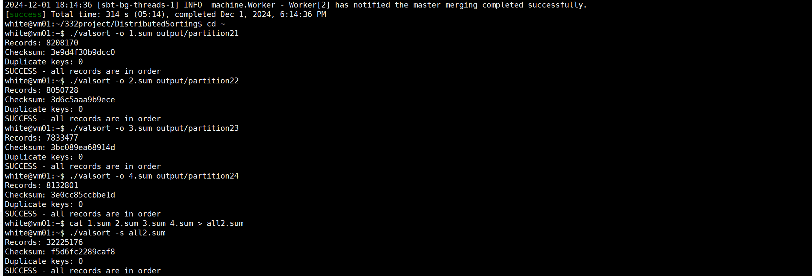 

Worker ID 3:
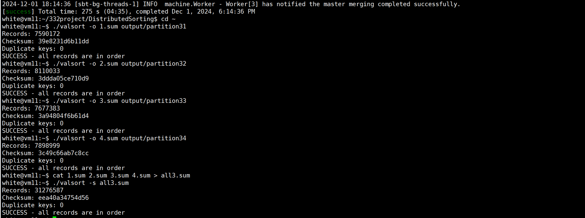 

Worker ID 4:
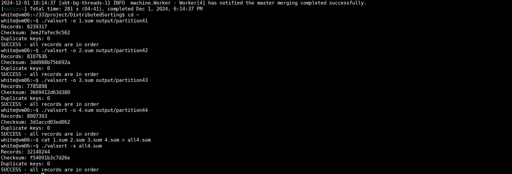 

Worker ID 5:
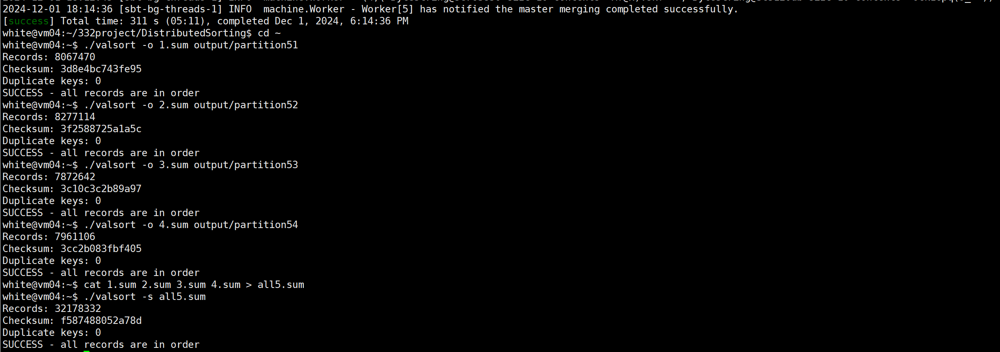 

Worker ID 6:
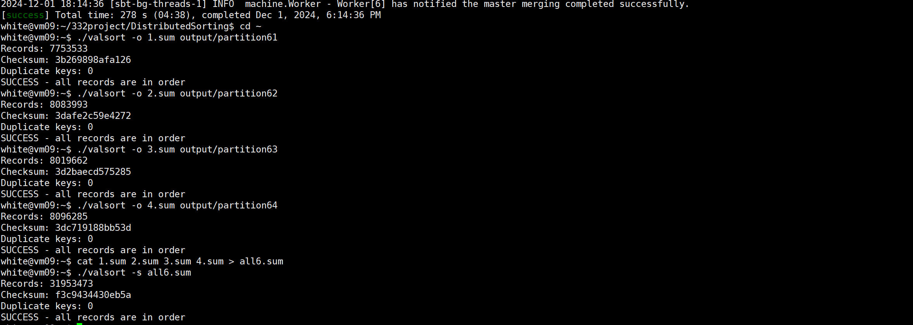 

Worker ID 7:
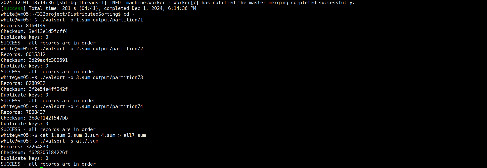 

Worker ID 8:
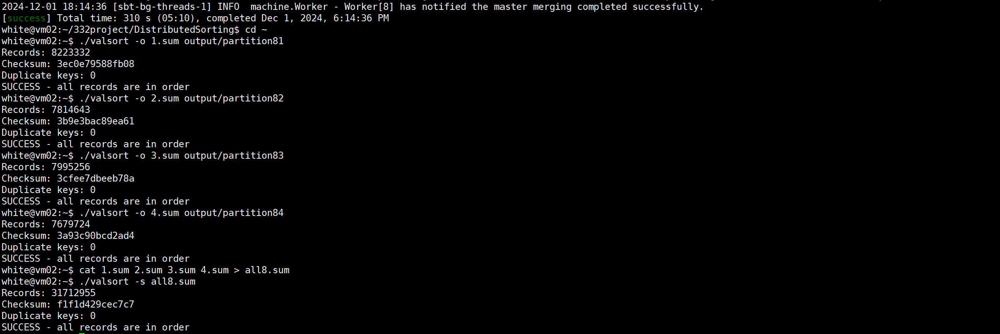 

Worker ID 9:
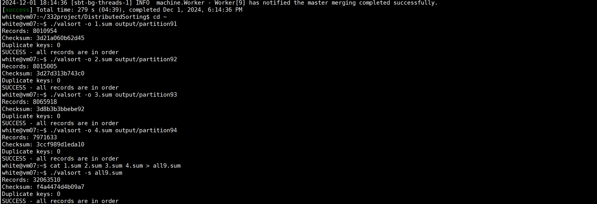 

Worker ID 10:
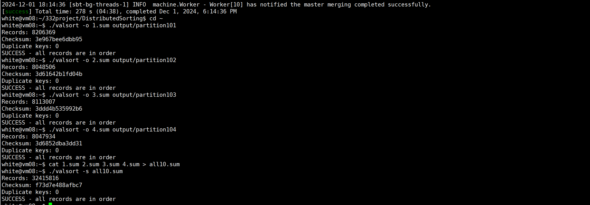 

Master:
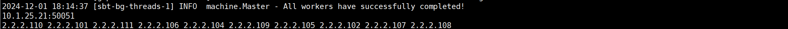

Test Result:
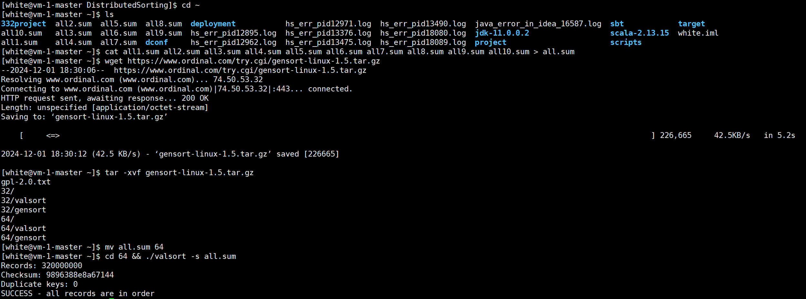
Total 320000000 records are correctly sorted. (1000 input files in each macine * 32000 record * 10 machine)
