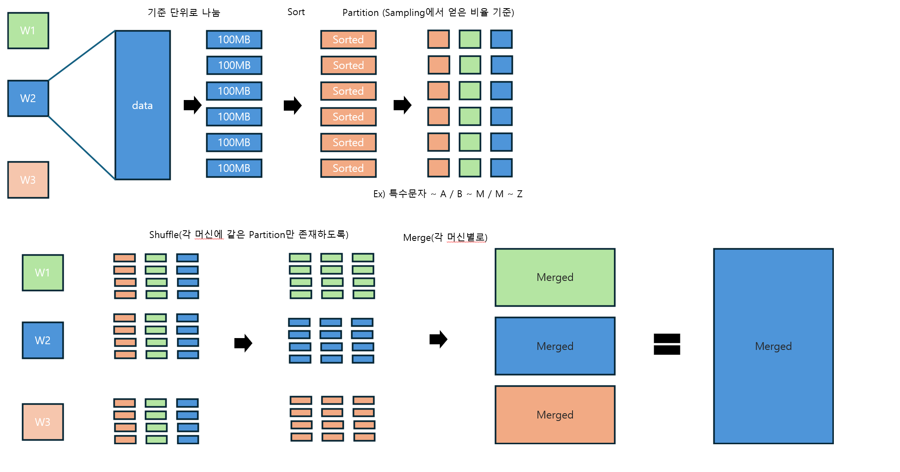

# Week2

2024-10-27

- Weekly Plan
    - week1 : 전체적 계획 수립
    - week2 : gRPC, 프로젝트 이해
    - week3 : gRPC테스트 코드 작성, 디자인 완성
    - week4 : 코드 작성
    - week5 : 코드 작성 완료, 테스트 케이스 작성
    - week6 : 디버깅, 중간 발표 준비
    - week7 : 디버깅
    - week8 : 최종 보고서, 발표 준비
- Milestone
    - Master와 Worker간의 communication 구현
    - Sampling 방법 설정 및 구현
    - sort어떻게 할 것인지 (2-way merge, k-way merge) + merge 방법 설정 및 구현
    - shuffling 구현

- ChatGPT 활용 전략
    
    chatGPT에게 어떤 질문? : 각 알고리즘이 무엇인지 / 개발 방향에 맞추어 sampling 등의 알고리즘을 어떻게 구현할 지 / 인터넷 검색과 병행하며 알고리즘 이해하기
    
- 이번 주 회의 내용
    
    
    
    - JDK 등 개발 환경 버전 확정 : 가장 최신 버전
    - Parallel sort 이해 확인
    - 간략한 디자인 그리기
    - chatGPT 등 AI 도구 활용 전략 토론
- 다음 주 목표
    - 알고리즘 및 디자인 완성
    - gRPC 이해를 위한 테스트 코드 작성
    
- 개인 목표
    - 고민석
        - 디자인
    - 하동은
        - 디자인
    - 신재욱
        - gRPC 이해를 위한 테스트 코드 작성