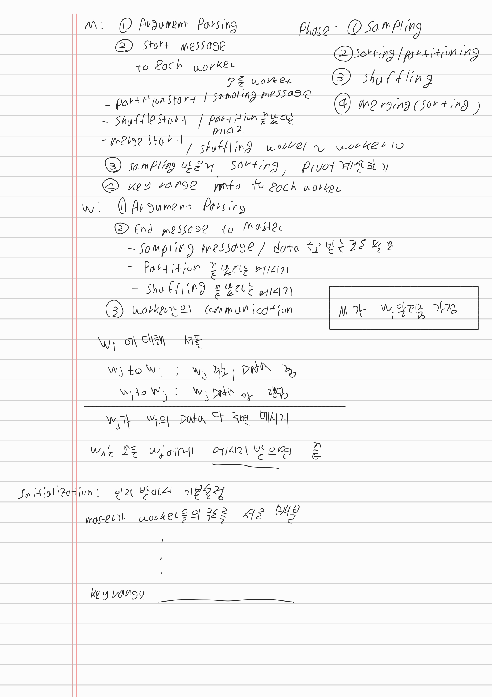
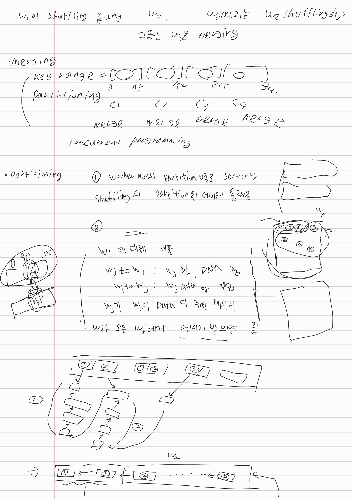
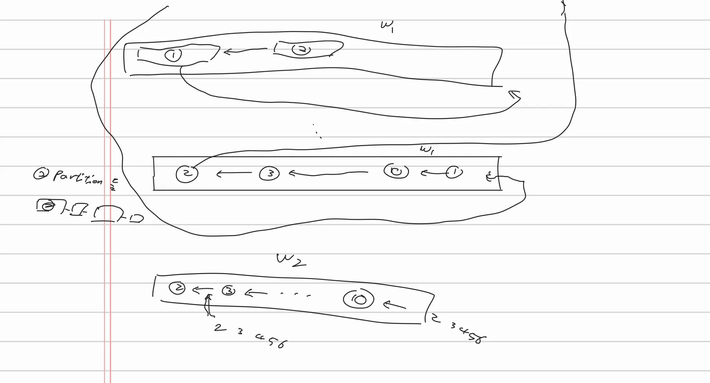
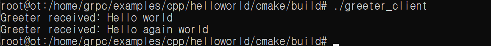
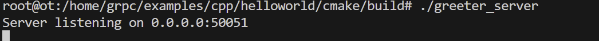

# Week3

2024-11-01

- Weekly Plan
    - week1 : 전체적 계획 수립
    - week2 : gRPC, 프로젝트 이해
    - week3 : gRPC테스트 코드 작성, 디자인
    - week4 : 구체적인 디자인, 코드 작성
    - week5 : 코드 작성 완료, 테스트 케이스 작성
    - week6 : 디버깅, 중간 발표 준비
    - week7 : 디버깅
    - week8 : 최종 보고서, 발표 준비
- Milestone
    - Master와 Worker간의 communication 구현
    - Sampling 방법 설정 및 구현
    - sort어떻게 할 것인지 (2-way merge, k-way merge) + merge 방법 설정 및 구현
    - shuffling 구현
- 이번 주 회의 내용 (디자인)

- gRPC
    - gRPC이해를 위해 gRPC공식 사이트의 quick start대로 따라 해봤다.
    - [Quick start | C++ | gRPC](https://grpc.io/docs/languages/cpp/quickstart/)
    - 편의상 C++로 테스트 하였다.
        - 추후 JAVA로 할 예정
    - 서버가 메시지를 보내면, 클라이언트가 메시지를 받을 수 있다.
    - 메시지를 다양하게 보낼 수 있는 정도까지 이해하였다.

- 다음 주 목표
    - 더 구체적인 디자인
    - 기본 코드 작성
- 개인 목표
    - 고민석
        - 구체적인 디자인
    - 하동은
        - 구체적인 디자인
        - gensort 작동
    - 신재욱
        - gRPC로 파일 전송 예제 구현
        - 학교 마스터 워커 대상으로 메시지 전달 되는지